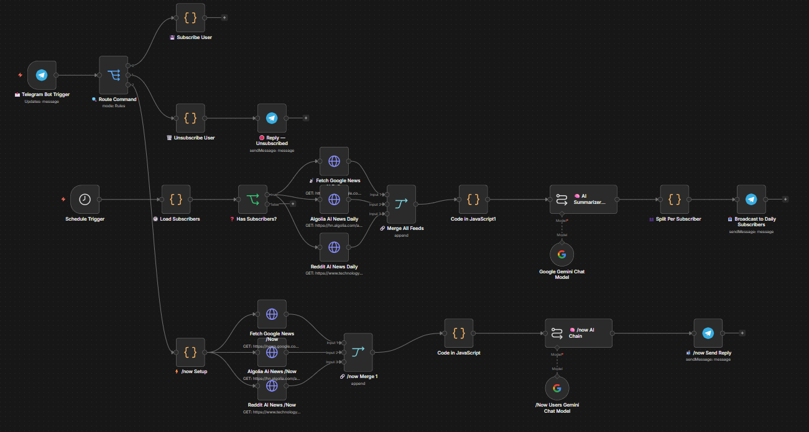

🤖 Pulse AI: Autonomous Tech News Curator
====================================================================

Pulse AI is an event-driven and CRON-scheduled background agent that aggregates tech and AI news across multiple disparate endpoints, executes AI-driven synthesis, and broadcasts customized digests directly to subscribers.

🚀 Live Deployments
----------------
* Telegram Bot: @PulseAI01_bot (https://t.me/PulseAI01_bot)

🏗️ System Architecture
-------------------
This Is the Preview Of How the Workflow Looks Like:-

The workflow leverages lightweight state management, concurrent API ingestion, and batch data routing:

* Database-less State Management: Instead of introducing heavy SQL/NoSQL database overhead, the agent utilizes n8n's workflow static data to persist user subscriptions. It programmatically tracks arrays of unique Chat IDs across dynamic /start and /stop command routing.

* Hybrid Trigger Matrix: The pipeline operates on two distinct planes: a scheduled CRON trigger executing daily at 11:00 AM UTC, and an on-demand /now webhook processor allowing users to force a real-time sync.

* Concurrent Data Ingestion: The agent simultaneously fires HTTP requests to aggregate JSON and XML feeds:
  - Google News RSS endpoints focusing on AI and Machine Learning parameters.
  - Algolia's HackerNews Search API filtering chronologically for mentions of "AI".
  - MIT Technology Review's RSS feed to capture long-form research announcements.

* LLM Synthesis & De-duplication: Consolidated raw text blobs are passed into a customized LangChain Chain powered by Gemini 2.5 Flash Lite and Gemini 3 Flash Preview models. The LLM acts as an autonomous editor—filtering noise, preventing duplicate stories, and enforcing strict 1-2 sentence summaries.

* Dynamic Batch Broadcasts: The generated digest passes into a JavaScript array-mapping engine that dynamically loops through the static subscriber list, iterating and firing individual Telegram API payloads per active user.

🛠️ Tech Stack
----------
* Automation & Orchestration: n8n, LangChain
* Large Language Models: Google Gemini 3 Flash, Gemini 2.5 Flash Lite
* Data Sources: Google News API, HackerNews (Algolia) API, MIT Tech Review
* State Management: JavaScript Static Data Objects

📥 Installation & Setup
--------------------
1. Clone this repository.
2. Open your self-hosted or cloud n8n instance.
3. Select "Import from File" and upload "🤖 Pulse AI Daily News AI Agent.json".
4. Connect your Google Gemini API and Telegram Bot Token in the credential blocks.
5. Send /start to the Telegram bot to initialize the subscriber array in the static memory block.

Developed by: Shayaan Patel
